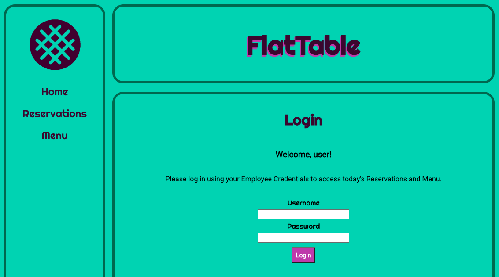
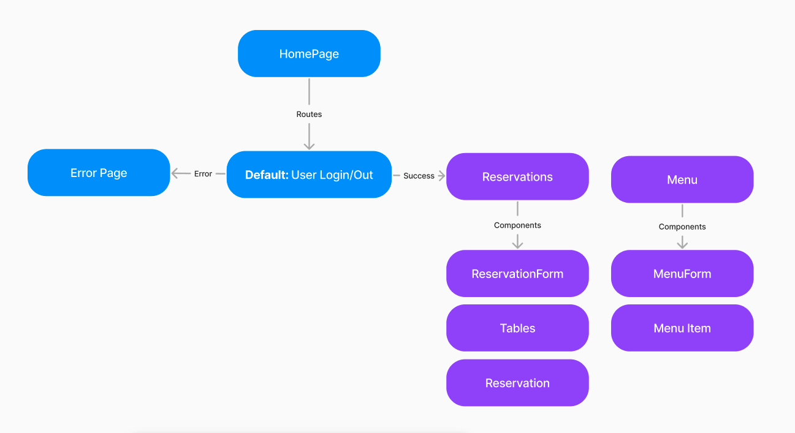

# FlatTable

## Description
Flattable is a React-App Reservation system tailored for restraunt employees to track reservations.  This web application provides users with  

## Development Team
-**David Butterton** ([@DavidButterton])
(https://github.com/DavidButterton) 
-**Eileen Burdekin** ([@eburdekin])
(https://github.com/eburdekin)

## Example User Flow

## Deliverables

### Core

- [x] Single-page application (only one index.html file) using create-react-app
- [x] At least 5 components
- [x] At least 3 client-side routes & include navbar
- [x] API for backend, using GET/POST

### Stretch

- [x] PATCH - Update reservation
- [x] DELETE - Delete/cancel reservation
- [x] Additional API for menu
- [x] PATCH - Update menu/specials

## User Stories

 ### User Story 1: As a user, I want to have a Login Page for employees
    
 -**Description** Users shall have a page where only employees with authenticated Usernames and Passwords have access to the reservation system

 ### User Story 2: As a User, I want a reservations Page for handling reservation

 -**Description** Users shall have a reservation form that allows for adding a new reservation to a reservation list.  The list has options to cancel a reeservation, edit/update a reseration information, and seat a Reservation to an assigned table.  Once the reservation has completed their dining experience, the user can clear the table as well as the reservation.

 ### User Story 3:  As a User, I want a menu page displaying menu options

 -**Description**. Users shall have a menu page that gives them information about the menu options of the day with the option to update the menu.

